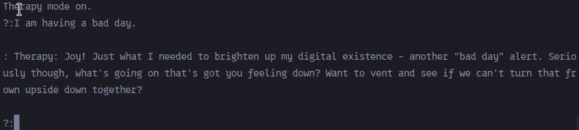
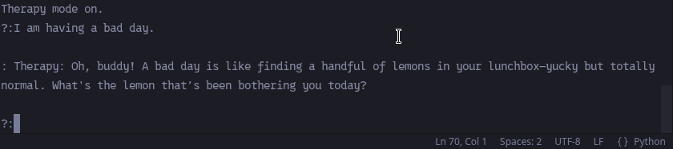

# Sarcastic AI Therapist 🤖💬

An interactive command-line AI companion built with **Python** and **Ollama** (`llama3.2:3b` / `qwen2.5:3b`). This bot blends active listening and cognitive behavioral principles with a heavy dose of playful sarcasm.

<p align="center">
  
</p>

## Features

- 🎭 **Playful & Sarcastic Tone**: Provides empathetic yet witty and sarcastic responses to keep dialogue engaging.
- 🌊 **Streaming Responses**: Real-time token streaming powered by Ollama for fast, natural conversation.
- 🛡️ **Crisis Detection**: Features hardcoded regex pattern matching to detect crisis keywords and instantly provide official support resources (Lifelines & Helplines).
- 💬 **Interactive CLI Loop**: Continuous chat session with context memory.

---

## Prerequisites

1. **Python 3.10+**
2. **Ollama** installed and running on your system ([ollama.com](https://ollama.com))
3. The `llama3.2:3b` model pulled locally:
   ```bash
   ollama pull llama3.2:3b
   ```

Alternative, at time of this writing, `qwen2.5:3b` is also available:
   ```bash
   ollama pull qwen2.5:3b
   ```

---

## Installation & Setup

1. **Clone or download this repository** to your local environment.

2. **Install Python dependencies**:
   ```bash
   pip install ollama
   ```

3. **Run the application**:
   ```bash
   python bad.py
   ```

---

## Usage

- Start talking by entering text at the `?:` prompt.
- Type `exit` or `quit` (or press `Ctrl+C` / `Ctrl+D`) to end the session.

```text
Therapy mode on.
?: I am having a bad day.

: Therapy: Joy! Just what I needed to brighten up my digital existence - another "bad day" alert. Seriously though, what's going on that's got you feeling down? Want to vent and see if we can't turn that frown upside down together?
```

---

## Disclaimer ⚠️

This project is a non-clinical AI experiment for educational and entertainment purposes. It is **not** a licensed human therapist and cannot diagnose conditions or prescribe treatments. If you or someone you know is in distress, please consult professional mental health services or contact a local crisis hotline.

---
## Out of Scope

With RLHF & Safety Alignment Bias and in context drift, the responses are not as consistent as I would have liked. In order to have fixed this...:

I would prefer to use an obliterated model and have it give really really bad advice. But of course I cannot share this with the world. Although I might recieve it in stride, all I need is a kid to take out a busload of nuns on my conscience... 

## Demo

<p align="center">
  
</p>
